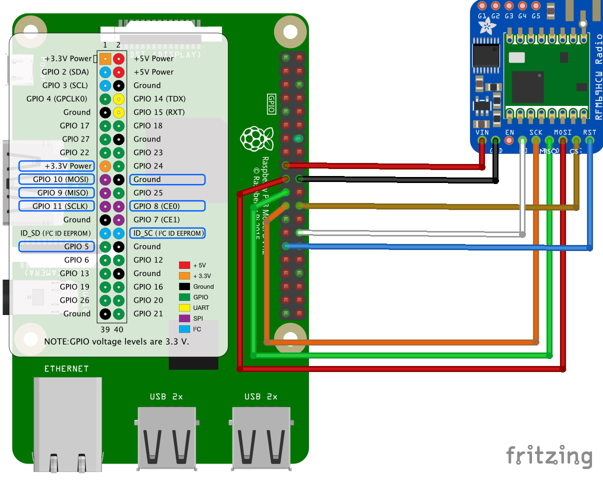
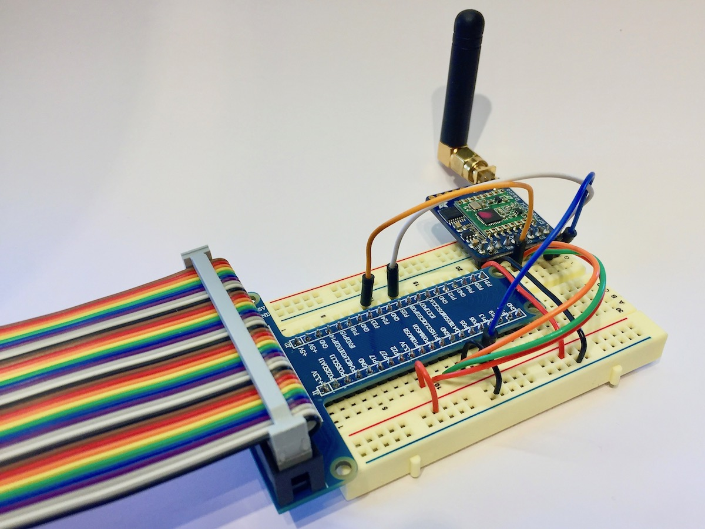
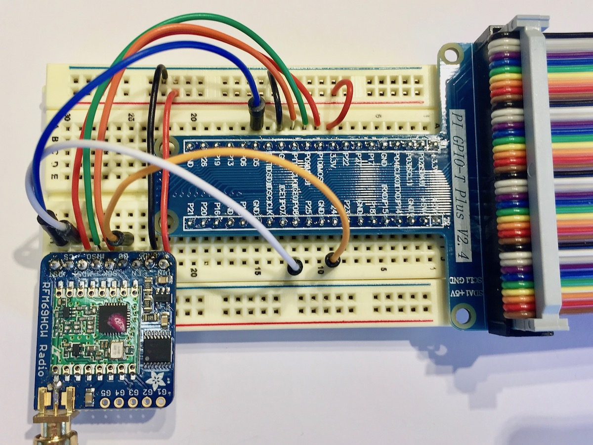

.. include:: global.rst

Connecting the Radio
====================

Wiring
------
The pins of the Raspberry Pi can be confusing and figuring out which pin is the right one and which one is going to make a loud popping noise can often mean repeated counting. If you struggle like I do, to mentally map from diagrams to the real world then I suggest buying or downloading a template card (a.k.a. a leaf).

So that is how we are going to connect it all up. Different makes of breakout board use different terminology. For example the Sparkfun boards use NSS rather than CS and DIO0 instead of G0. The table below is my best effort at making the wiring clear. If you come across any different terms then let me know and I will include them.

Pinout guide
------------

.. csv-table:: Pin Guide Raspberry Pi to RFM69HCW (Adafruit and Spark Fun breakouts)

    PI Name, 3v3 [#f1]_ ,	Ground,	MOSI, MISO, SCLK, ID_SC [#f2]_ , CE0	 
    PI GPIO [#f3]_, , , 10, 9, 11, , 8, 5
    PI Pin, 17, 25, 19, 21, 23, 18, 24, 29
    Adafruit, Vin, GND, MOSI, MISO, CLK, G0, CS, RST
    Sparkfun, 3.3v, GND, MOSI,	MISO, SCK, DIO0, NSS, RESET

.. rubric:: Footnotes

.. [#f1] This pin can only support low power mode. Use different supply if you want to use the RFM69HCW in high power mode.
.. [#f2] This is the interrupt pin. The RFM69HCW module calls an interrupt on the RPI when there is new data to process.
.. [#f3] These numbers refer to the pin index when you could from top left to bottom right i.e. odd number on the left and evens on the right. These are not the GPIO numbers. The Pinout.xyz is an amazingly helpful tool.

Setup Examples
--------------

