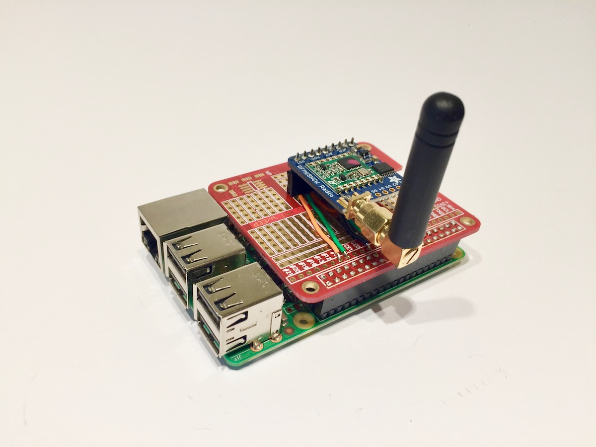

.. RFM69Radio documentation master file, created by
   sphinx-quickstart on Wed Apr 11 12:34:36 2018.
   You can adapt this file completely to your liking, but it should at least
   contain the root `toctree` directive.

.. include:: global.rst

.. warning::

   This project is an Alpha release and as such it may contain bugs. If you spot one then please report it as an issue on Github. We want to make this project awesome and to do that we need your help!

Welcome to RFM69Radio's documentation!
======================================
This package provides a Python wrapper of the `LowPowerLabs RFM69 library <https://github.com/LowPowerLab/RFM69>`_ and is largely based on the work of `Eric Trombly <https://github.com/etrombly/RFM69>`_ who ported the library from C.

The package expects to be installed on a Raspberry Pi and depends on the `RPI.GPIO <https://pypi.org/project/RPi.GPIO/>`_ and `spidev <https://pypi.org/project/spidev/>`_ libraries. In addition you need to have an RFM69 radio module directly attached to the Pi. For details on how to connect such a module checkout this guide :doc:`hookup`.

Contribute
----------
- Issue Tracker: https://github.com/jkittley/RFM69Radio/issues
- Source Code: https://github.com/jkittley/RFM69Radio

Support
-------
If you are having issues, please let us know by submitting an `issue <https://github.com/jkittley/RFM69Radio/issues>`_.

License
-------
The project is licensed under the MIT license.

.. toctree::
   :maxdepth: 2
   :caption: Contents:

   hookup
   install
   example
   api

Indices and tables
------------------

* :ref:`genindex`
* :ref:`modindex`
* :ref:`search`
